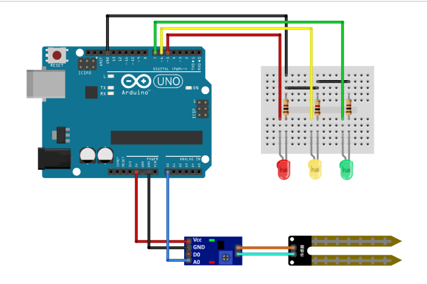

O projeto “Sistema de irrigação automatizado” tem como objetivo a criação de um dispositivo que se comunica com um aplicativo para monitorar uma planta e auxiliar no processo de irrigação.
O sensor de solo detecta as variações de umidade no local onde a sonda está enterrada. O módulo possui duas saídas, uma analógica e outra digital. A saída analógica é a saída do sensor em si, ela varia de acordo com a umidade do solo. A saída digital é a de um comparador LM393, que fornece apenas níveis altos e baixos. Para controles de precisão maior é recomendado usar a saída analógica, assim você pode escalonar várias faixas de atuação para o seu sistema. Usando a saída digital você faz apenas um controle ON/OFF baseado em dois limites de leitura do sensor.
O princípio de funcionamento é simples. Como você pode ver na imagem abaixo, o módulo possui duas hastes com dois longos contatos cada. Trata-se de um sensor cuja resistência elétrica varia de acordo com a umidade do solo. Assim, quanto mais úmido estiver o solo, menor a resistência do sensor. Quanto mais seco, maior a resistência do sensor.
Com a saída digital(D0), o funcionamento básico é o seguinte: Quando a umidade está baixa(solo seco), a saída fica em nível alto. Do contrário(solo úmido), a saída fica em nível baixo. Um pequeno potenciômetro embutido no sensor é usado para ajustar os limites de referência. 

